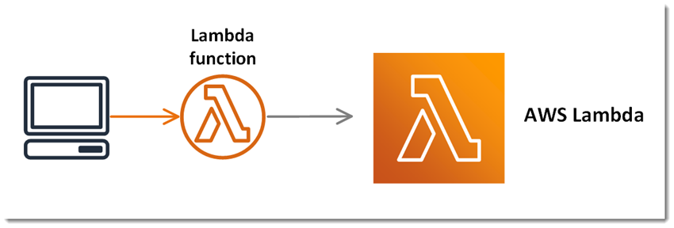
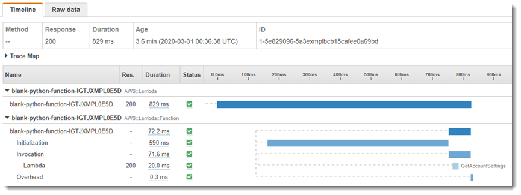

# Harmony matcher wrapper (AWS Lambda function) (Python)

The matcher component calculates the similarity between items.

This AWS Lambda wrapper is smart, as it caches texts so that we don't need to call the vectoriser so often.

It's built on top of an AWS Lambda Pandas layer arn:aws:lambda:eu-west-2:336392948345:layer:AWSSDKPandas-Python39:6.

# Deployment via Github Actions (CI/CD)

You should not need to manually deploy this function, as a Github action is configured to deploy to AWS Lambda when a push is made to `main`. However, manual deployment instructions via bash scripts are also provided at the bottom of this README.

# Environment variables needed

You need to create a variable `VECTOR_API_KEY` containing an API key for the Hugging Face Hub. It is cheaper to use a HuggingFace deployment than an AWS deployment.

You can also optionally create a variable `VECTOR_API_URL` pointing to the URL of the vectorisation API.

Based on Python function from AWS Lambda Developer Guide  (https://github.com/awsdocs/aws-lambda-developer-guide).

# Alternative to HuggingFace API

You can alternatively deploy the HuggingFace transformer model directly to AWS Lambda, however this works out more expensive to host. The alternative deployment script is in the folder `optional_transformer_llm_huggingface_lambda`.

# Calling this function

```
curl -X 'POST' \
  'https://brqzw24fwuaptjgi6nhu4k6wi40fpjxe.lambda-url.eu-west-2.on.aws/' \
  -H 'accept: application/json' \
  -H 'Content-Type: application/json' \
  -d '{
  "instruments": [
    {
      "file_id": "fd60a9a64b1b4078a68f4bc06f20253c",
      "instrument_id": "7829ba96f48e4848abd97884911b6795",
      "instrument_name": "GAD-7 English",
      "file_name": "GAD-7 EN.pdf",
      "file_type": "pdf",
      "file_section": "GAD-7 English",
      "language": "en",
      "questions": [
        {
          "question_no": "1",
          "question_intro": "Over the last two weeks, how often have you been bothered by the following problems?",
          "question_text": "Feeling nervous, anxious, or on edge",
          "options": [
            "Not at all",
            "Several days",
            "More than half the days",
            "Nearly every day"
          ],
          "source_page": 0
        },
        {
          "question_no": "2",
          "question_intro": "Over the last two weeks, how often have you been bothered by the following problems?",
          "question_text": "Not being able to stop or control worrying",
          "options": [
            "Not at all",
            "Several days",
            "More than half the days",
            "Nearly every day"
          ],
          "source_page": 0
        }
      ]
    },
    {
      "file_id": "fd60a9a64b1b4078a68f4bc06f20253c",
      "instrument_id": "7829ba96f48e4848abd97884911b6795",
      "instrument_name": "GAD-7 Portuguese",
      "file_name": "GAD-7 PT.pdf",
      "file_type": "pdf",
      "file_section": "GAD-7 Portuguese",
      "language": "en",
      "questions": [
        {
          "question_no": "1",
          "question_intro": "Durante as últimas 2 semanas, com que freqüência você foi incomodado/a pelos problemas abaixo?",
          "question_text": "Sentir-se nervoso/a, ansioso/a ou muito tenso/a",
          "options": [
            "Nenhuma vez",
            "Vários dias",
            "Mais da metade dos dias",
            "Quase todos os dias"
          ],
          "source_page": 0
        },
        {
          "question_no": "2",
          "question_intro": "Durante as últimas 2 semanas, com que freqüência você foi incomodado/a pelos problemas abaixo?",
          "question_text": " Não ser capaz de impedir ou de controlar as preocupações",
          "options": [
            "Nenhuma vez",
            "Vários dias",
            "Mais da metade dos dias",
            "Quase todos os dias"
          ],
          "source_page": 0
        }
      ]
    }
  ],
  "query": "anxiety",
  "parameters": {
    "framework": "huggingface",
    "model": "sentence-transformers/paraphrase-multilingual-MiniLM-L12-v2"
  }
}'
```


# Architecture



The project source includes function code and supporting resources:

- `function` - A Python function.
- `template.yml` - An AWS CloudFormation template that creates an application.
- `1-create-bucket.sh`, `2-build-layer.sh`, etc. - Shell scripts that use the AWS CLI to deploy and manage the application.

Use the following instructions to deploy the application.

# Requirements
- [Python 3.7](https://www.python.org/downloads/). Sample also works with Python 3.8 and 3.9. 
- The Bash shell. For Linux and macOS, this is included by default. In Windows 10, you can install the [Windows Subsystem for Linux](https://docs.microsoft.com/en-us/windows/wsl/install-win10) to get a Windows-integrated version of Ubuntu and Bash.
- [The AWS CLI](https://docs.aws.amazon.com/cli/latest/userguide/cli-chap-install.html) v1.17 or newer.

If you use the AWS CLI v2, add the following to your [configuration file](https://docs.aws.amazon.com/cli/latest/userguide/cli-configure-files.html) (`~/.aws/config`):

```
cli_binary_format=raw-in-base64-out
```

This setting enables the AWS CLI v2 to load JSON events from a file, matching the v1 behavior.

# Setup
To create a new bucket for deployment artifacts, run `1-create-bucket.sh`.

    ./1-create-bucket.sh

To build a Lambda layer that contains the function's runtime dependencies, run `2-build-layer.sh`. Packaging dependencies in a layer reduces the size of the deployment package that you upload when you modify your code.

    ./2-build-layer.sh

# Deploy
To deploy the application, run `3-deploy.sh`.

    ./3-deploy.sh

This script uses AWS CloudFormation to deploy the Lambda functions and an IAM role. If the AWS CloudFormation stack that contains the resources already exists, the script updates it with any changes to the template or function code.

# Test
To invoke the function, run `4-invoke.sh`.

    blank-python$ ./4-invoke.sh
    {
        "StatusCode": 200,
        "ExecutedVersion": "$LATEST"
    }
    {"TotalCodeSize": 410713698, "FunctionCount": 45}

Let the script invoke the function a few times and then press `CRTL+C` to exit.

The application uses AWS X-Ray to trace requests. Open the [X-Ray console](https://console.aws.amazon.com/xray/home#/service-map) to view the service map. The following service map shows the function calling Amazon S3.


Choose a node in the main function graph. Then choose **View traces** to see a list of traces. Choose any trace to view a timeline that breaks down the work done by the function.



# Cleanup
To delete the application, run `5-cleanup.sh`.

    $ ./5-cleanup.sh       